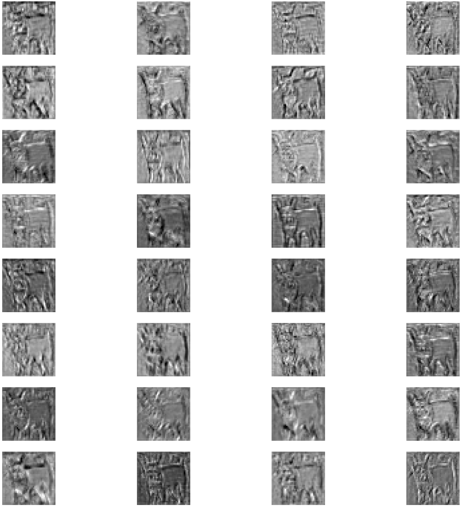
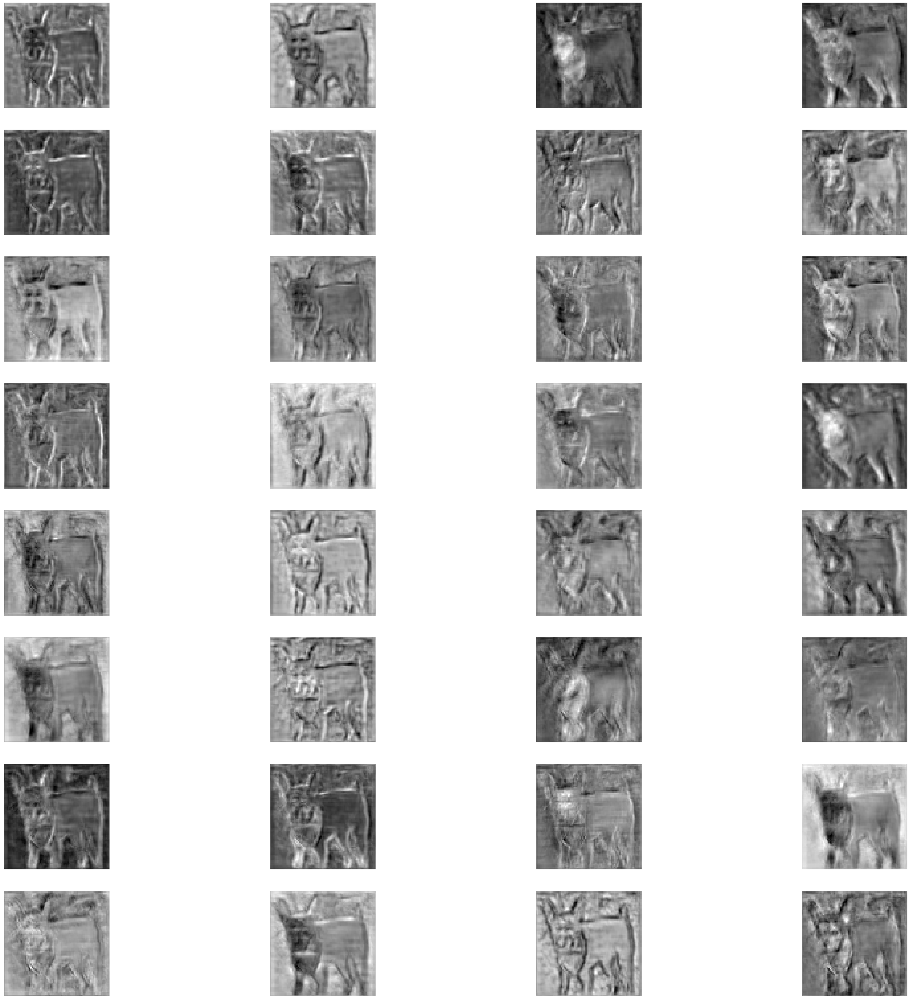

# Visualize-feature-maps
Visualize feature maps in convolutional neural networks(CNN).  
I used [SD_UNet](https://www.mdpi.com/2079-9292/11/1/130) model for semantic segmentation task on Oxford Pets dataset.  
[google colab link](https://colab.research.google.com/github/alireza-sheikh/Visualize_feature_maps_tensorflow/blob/main/VisualLayers_SD_UNet.ipynb)  
You can download model weight by this [link](https://drive.google.com/file/d/1zIaIKqaOL_pAnodqxp3aB5jgblv68PvS/view?usp=sharing).
1. Dataset:  
This dataset has 37 category pet dataset with roughly 200 images for each class. The images have a large variations in scale, pose and lighting. All images have an associated ground truth annotation of breed, head ROI, and pixel level trimap segmentation. 
  
2. Model:
This model has a encoder and decoder part and in the bottleneck there is DASPP(dense atrous spatial pyramid pooling) module.  

    1. Encoder:  
       In this part we have two blocks, squeeze and attention(SA) block and downsample block.   
          
    2. Bottleneck:
        In this part we have dense atrous spatial pyramid pooling layer (DASPP).  
        
    3. Decoder:
        In this part we have SA blocks and upsample blocks.  
3. Result:  
After training model on dataset, we can get convolution layers number with this code.
```python
def get_conv_layers(model: tf.keras.Model):
  """
  This function get model as input and return a list of convolution layers indexes.
  args:
    model: Tensorflow model.
  return:
    layer_number: number of convolution layers.
    filters, biases: weights of convolution layers filters.
  """
  i = 0
  layer_number = []
  for layer in model.layers:
    i += 1
  # check for convolutional layer
    if 'conv' not in layer.name:
      continue
  # get filter weights
    filter, bias = layer.get_weights()
    layer_number.append(i)
    print(f'number of conv in order of layers is: {i+1}\n', layer.name, filter.shape, bias.shape)
  return layer_number

```
Then we redifine model, this new model includes only convolution layers, then we can plot
the outputs of all convolution layers which are stored in "feature_maps" variable.  
I picked first sample of test data as input for new model.  
```python
# Use first image of test data as input to visualize the feature maps
img = test_gen[0][0][0]
# Convert 3d array to 4d array
img = np.expand_dims(img, axis=0)
outputs = [model.layers[i-1].output for i in layer_number]
# redefine model to output right after the all convolution layers
model_all_convs = Model(inputs=model.inputs, outputs=outputs)
feature_maps = model_all_convs.predict(img)
```
Now we have all outputs of convolution layers and we can plot them but they are too many to plot so
we plot only 32 images of each layers.  
Note: Model has 51 convolution layers.
#**First convolution layer outputs**

#**Fifth convolution layer outputs**

#**Twelfth convolution layer outputs**

#**Twenty fourth convolution layer outputs**

#**Thirty third convolution layer outputs**

#**Forty third convolution layer outputs**

#**Fiftieth convolution layer outputs**

#**Fifty First (the last) convolution layer outputs**

As we can see, at earlier layers, model tries to focus on fine details. The feature map is more abstract as we go 
deeper, till around convolution layer 43, at this stage feature maps becomes more like the mask because in semantic
segmentation task the outputs must be like mask as much as possible.


